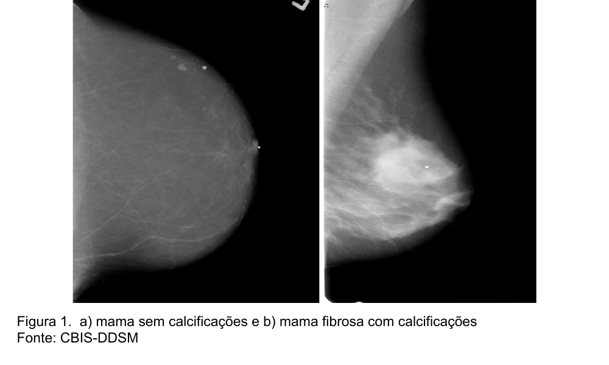
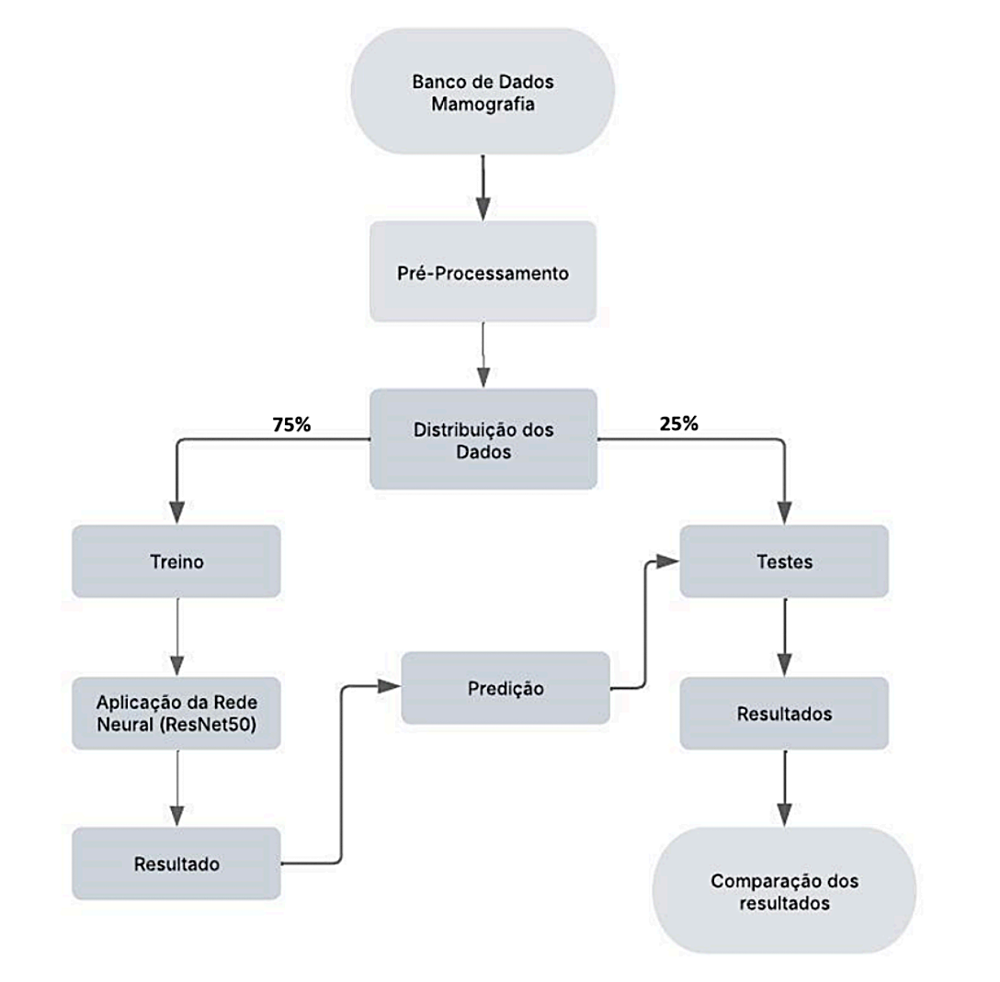
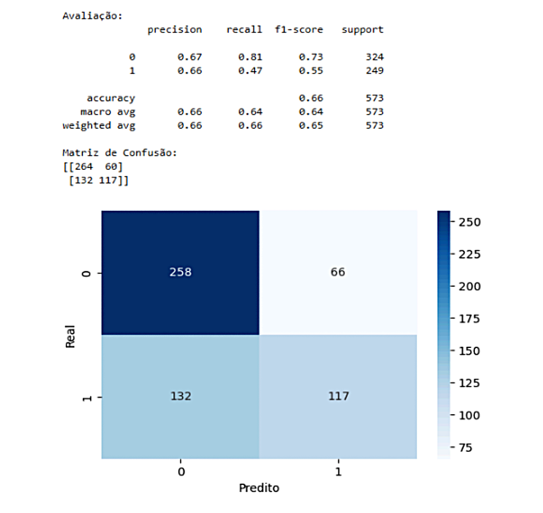
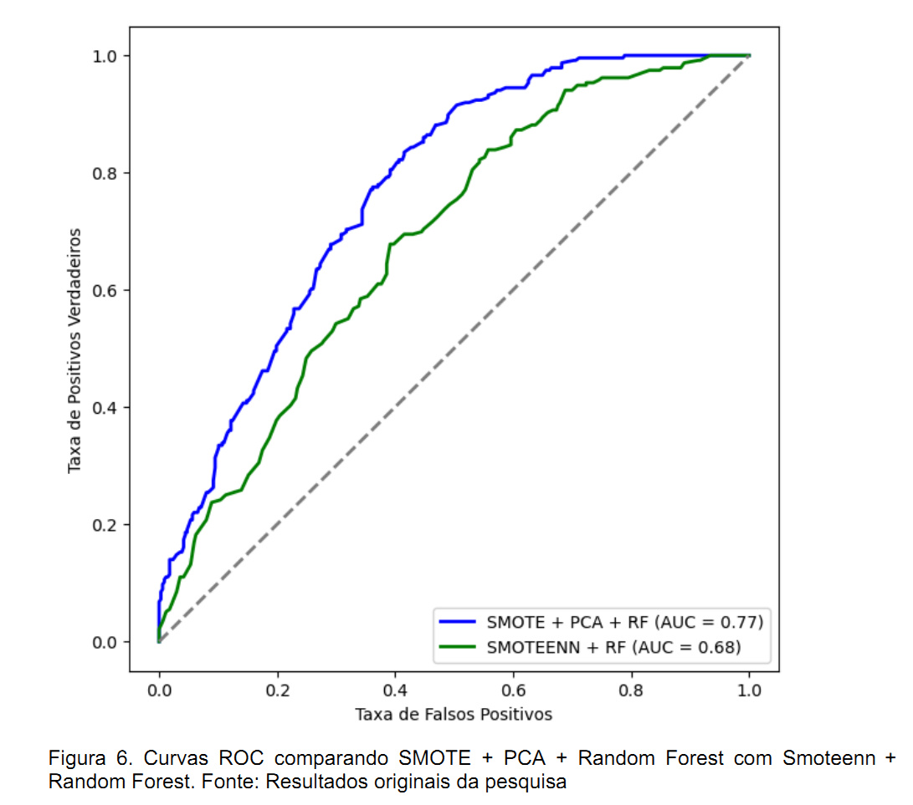

# Detecção de Neoplasias Mamárias com Redes Neurais Convolucionais
# 🩺 Detecção de Neoplasias Mamárias com Redes Neurais Convolucionais

> **Trabalho de Conclusão de Curso** — MBA em Data Science & Analytics | USP/ESALQ 2025  
> **Autor:** André Luiz Magalhães de Oliveira  
> **Orientador:** Hugo Bampi

[](https://python.org)
[](https://tensorflow.org)
[](https://scikit-learn.org)
[](.)

---

## 📌 Visão Geral

Este projeto investiga a utilização de **Redes Neurais Convolucionais (ResNet50)** para a identificação e classificação de neoplasias mamárias em imagens de mamografia. O câncer de mama é um dos tipos mais recorrentes no Brasil, e o diagnóstico precoce é fundamental para o sucesso do tratamento.

O objetivo deste trabalho é auxiliar o diagnóstico clínico através de algoritmos de aprendizado de máquina, aumentando a precisão na identificação de lesões malignas e benignas.


*Figura 1: a) Mama sem calcificações; b) Mama fibrosa com calcificações (Fonte: CBIS-DDSM)*

---

## ⚙️ Metodologia

O desenvolvimento seguiu um pipeline estruturado, desde o pré-processamento de imagens DICOM até a avaliação de modelos complexos para lidar com o desbalanceamento de classes.


*Figura 2: Fluxograma do processo de análise e classificação.*

### Etapas do Projeto:
1.  **Banco de Dados:** Utilização do dataset **CBIS-DDSM** (Curated Breast Imaging Subset of Digital Database for Screening Mammography).
2.  **Pré-processamento:** Distribuição dos dados (75% treino / 25% teste) e extração de características (raio, textura, perímetro, área, etc.).
3.  **Modelagem:**
    *   **ResNet50 (Baseline):** Rede neural convolucional para extração de características e classificação inicial.
    *   **SMOTE + PCA + Random Forest:** Técnica de sobreamostragem sintética combinada com redução de dimensionalidade e florestas aleatórias para melhorar o equilíbrio entre precisão e recall.
    *   **SMOTEENN:** Combinação de SMOTE com Edited Nearest Neighbor para limpeza de ruído.

---

## 📈 Resultados e Discussão

Os modelos foram avaliados com base em métricas de Acurácia, Precisão, Recall e AUC-ROC. O modelo que apresentou o melhor equilíbrio para aplicação clínica foi a combinação **SMOTE + PCA + Random Forest**.

### Comparação de Modelos

| Modelo | Acurácia | Precisão (Classe 1) | Recall (Classe 1) | AUC-ROC |
| :--- | :---: | :---: | :---: | :---: |
| ResNet50 (Baseline) | 66% | 66% | 47% | - |
| **SMOTE + PCA + RF** | **70%** | **61%** | **67%** | **0.77** |
| SMOTEENN + RF | 66% | 53% | 81% | 0.68 |

### Visualizações de Desempenho

| Matriz de Confusão (SMOTE+PCA+RF) | Curvas ROC |
| :---: | :---: |
|  |  |

> **Conclusão:** O modelo SMOTE + PCA + Random Forest obteve um AUC de 0.77, classificado como "Bom" em escala clínica, demonstrando ser uma ferramenta promissora para o suporte à decisão médica.

---

## 🗂️ Estrutura do Repositório

```text
portfolio_redes_neurais/
├── assets/
│   └── images/              # Imagens e gráficos extraídos do TCC
├── notebook/
│   └── breast_cancer_classification.ipynb   # Pipeline completo
├── results/                 # Gráficos gerados durante a execução
├── README.md                # Documentação principal
└── requirements.txt         # Dependências do projeto
```

---

## 🚀 Como Executar

1.  **Clone o repositório:**
    ```bash
    git clone https://github.com/AndreeLMO/portfolio_redes_neurais.git
    ```
2.  **Instale as dependências:**
    ```bash
    pip install -r requirements.txt
    ```
3.  **Execute o Notebook:**
    Abra o arquivo `notebook/breast_cancer_classification.ipynb` em seu ambiente Jupyter.

---

## 📄 Citação

Se este trabalho for útil para sua pesquisa, por favor cite:

> OLIVEIRA, André Luiz Magalhães de; BAMPI, Hugo. **Utilização de redes neurais convolucionais para identificação de neoplasias mamárias.** 2025. Trabalho de Conclusão de Curso (Especialização em Data Science & Analytics) - USP/ESALQ, Piracicaba, 2025.

---

## 📬 Contato

**André Luiz Magalhães de Oliveira**  
📧 [andreluizmoliveira7@gmail.com](mailto:andreluizmoliveira7@gmail.com)  
[](https://www.linkedin.com/in/andreluizmoliveira7)
[](https://github.com/AndreeLMO)
